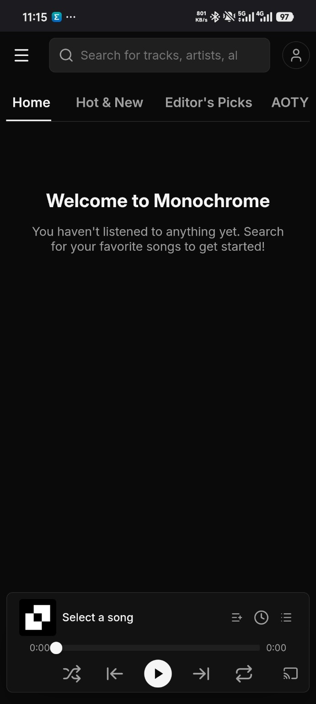
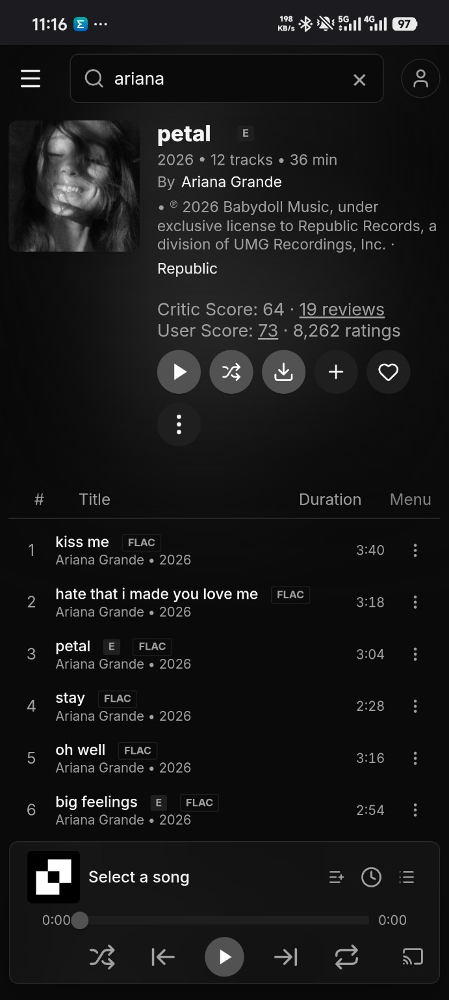
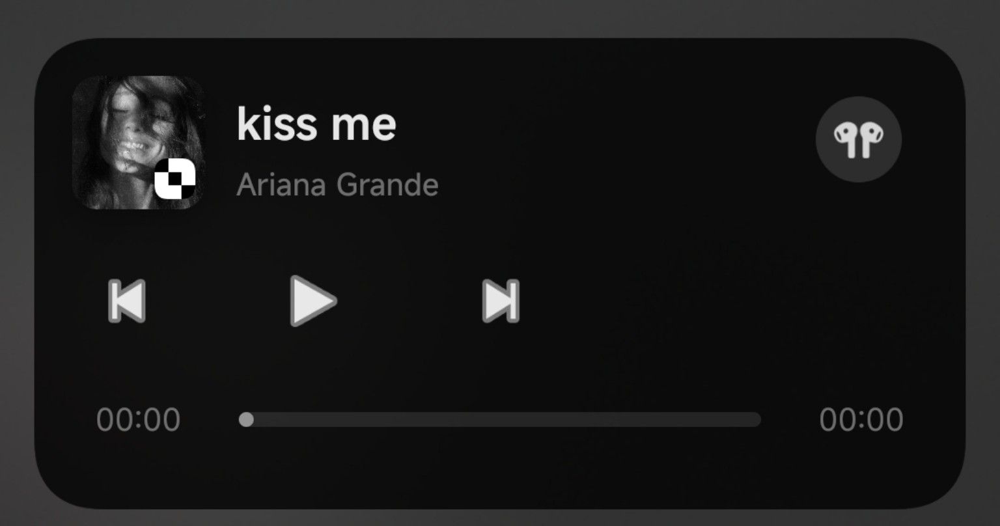
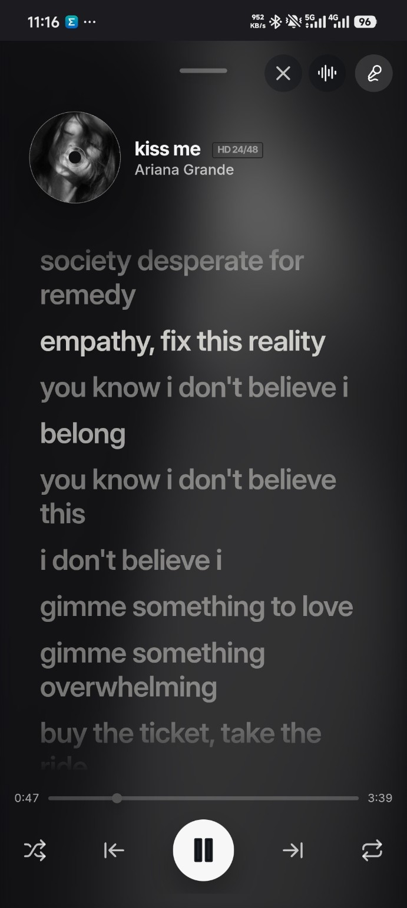
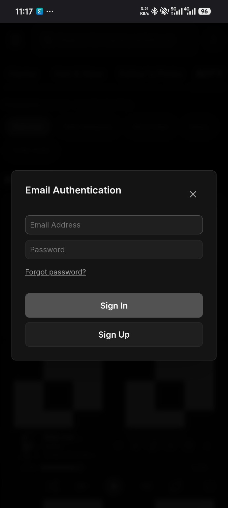

# Monochrome Android

### Enhanced Android WebView client for Monochrome

Native Android media controls • Foreground/background audio • Downloads • Fullscreen playback

---

## 📱 About

**Monochrome Android** brings the [Monochrome](https://monochrome.tf) web experience to Android through an enhanced WebView app with Android-native media integration.

It is designed to feel more like a native music app than a basic browser wrapper, with foreground/background audio, Android media controls, downloads, fullscreen playback, account access, and other Android integrations.

> **This repository is the public information, issue-tracking, and APK release page for Monochrome Android.**
>
> Application source code is not published here. APK builds are distributed through **GitHub Releases**.

  
  &nbsp;&nbsp;
  

---

## 🌐 Monochrome Web Project

Monochrome Android is built around the Monochrome web experience.

- **Website:** https://monochrome.tf
- **Monochrome GitHub:** https://github.com/monochrome-music/monochrome

> Monochrome Android is a separate Android WebView application and is not the official Android client of the Monochrome web project unless explicitly stated otherwise.

---

## ✨ Features

<table>
<tr>
<td width="50%" valign="top">

### 🎵 Native Media Controls

- Android MediaSession integration
- Play / pause
- Previous / next when supported
- Track title and artist metadata
- Album artwork when available
- Notification media controls
- Lock-screen media controls
- Android system media panel integration
- Bluetooth/media-button support

</td>
<td width="50%" valign="top">

### 🔊 Foreground & Background Audio

- Foreground media playback service
- Background audio playback
- Screen-off playback
- Persistent media notification while required
- Playback control without reopening the app
- Better compatibility with Android background restrictions

</td>
</tr>

<tr>
<td width="50%" valign="top">

### ⬇️ Downloads

- Download supported content from the WebView
- Android download handling
- Download notifications
- Filename and MIME-type handling
- Files remain accessible outside the app
- Native Android download experience where supported

</td>
<td width="50%" valign="top">

### 🎬 Media & Fullscreen

- HTML5 audio/video playback
- Fullscreen media support
- Landscape playback
- Media-session synchronization
- Playback state integration
- Improved media handling while navigating

</td>
</tr>

<tr>
<td width="50%" valign="top">

### 🌐 Android WebView

- Modern Android WebView rendering
- JavaScript support
- Cookies and session support
- Persistent sign-in sessions
- In-app navigation
- External-link handling
- File chooser/upload support where available

</td>
<td width="50%" valign="top">

### 📲 Android Integration

- Android notifications
- System back-navigation handling
- External-app handling
- Web-to-Android media integration
- App lifecycle handling
- Native Android permission handling when required

</td>
</tr>
</table>

---

## 🎧 Native Media Experience

Monochrome Android integrates compatible web playback with Android's native media system.

This allows active media to appear in Android surfaces such as the notification shade, lock screen, system media panel, and compatible connected media controls.

  

The foreground playback service helps keep audio available when the app is minimized or the screen is turned off.

---

## 🎶 Player & Lyrics

The Monochrome web player remains available inside the app, including supported playback controls, track information, progress, and synchronized lyrics provided by the website.

  

---

## ⬇️ Download Support

Supported downloads can be handed over to Android's download system directly from the WebView.

  

Depending on the source and file type, Android can show download progress and save the resulting file to the device's normal download location.

> Download availability depends on how the website exposes the content. DRM-protected, encrypted, blob-based, streamed, temporary, or otherwise restricted media may not be downloadable as a normal file.

---

## 🔐 Account & Authentication

Monochrome account authentication is available through the web interface inside the Android app. Existing cookies and supported sessions can remain available through Android WebView.

  

> Never share passwords, authentication tokens, cookies, or other private account information in GitHub issues.

---

## 📥 Downloads

Official APK builds are published through this repository's **Releases** page.

### Download the latest APK from GitHub Releases

**Releases → Latest Release → Assets → APK**

### Installation

1. Open the latest GitHub release.
2. Expand **Assets** if necessary.
3. Download the `.apk` file.
4. Open the APK on your Android device.
5. Allow installation from the browser or file manager if Android asks.
6. Install or update Monochrome Android.

> Existing installations can normally be updated directly when the new APK uses the same package name and signing key.

---

## 🔐 Permissions

Depending on the Android version and enabled features, Monochrome Android may use permissions or capabilities related to:

| Permission / Capability | Purpose |
|---|---|
| Internet access | Load Monochrome and online content |
| Notifications | Media and download notifications |
| Foreground service | Keep active media playback running |
| Media playback service | Support foreground/background audio |
| Storage / media access | Supported file operations where required |
| File chooser | Allow websites to request files from the device |

Android permission behavior can vary by OS version.

---

## 📋 Requirements

- Android device with a compatible **Android System WebView**
- Internet connection
- Notification permission for full media-control functionality on Android versions that require it
- Permission to install APK files when installing outside Google Play

Keeping **Android System WebView** updated is recommended.

---

## 🚀 Releases

Releases may include:

- New APK versions
- Bug fixes
- Media playback improvements
- Android compatibility updates
- WebView improvements
- Download handling improvements
- Release notes and known issues

---

## 🐛 Issues & Feedback

If you encounter a problem, open a GitHub issue and include:

- App version
- Android version
- Device model
- Android System WebView version
- Steps to reproduce
- Screenshot or screen recording when useful
- Logcat/crash output for crashes

Useful issue examples include media controls not responding, audio stopping in the background, fullscreen playback problems, download failures, file chooser issues, or pages failing to load correctly.

Please do not post passwords, cookies, authentication tokens, or other sensitive information.

---

## ❓ FAQ

<b>Where can I download Monochrome Android?</b>

APK files are published through this repository's **GitHub Releases** page.

<b>Is the application source code available?</b>

No. This repository currently serves as the public information, issue-tracking, documentation, and APK release page for Monochrome Android.

<b>Can audio continue when the app is minimized or the screen is off?</b>

Foreground/background audio support is designed to keep compatible media playback active while the app is minimized or the screen is off.

<b>Why does Android show a media notification?</b>

Android uses a foreground-service notification for ongoing foreground media playback. The notification also provides native playback controls.

<b>Why can't some media be downloaded?</b>

Download support depends on the resource exposed by the website. DRM, encrypted streams, blob URLs, temporary links, and some streaming formats may not be available as normal downloadable files.

<b>Does Monochrome Android replace Android System WebView?</b>

No. The app uses the WebView implementation available on the Android device.

---

## 📦 About This Repository

This repository intentionally contains **no application source code**.

It is maintained for:

- APK releases
- Release notes
- Issue reports
- Announcements
- User documentation

---

## ⭐ Star History

---

## ⚠️ Disclaimer

Monochrome Android is a WebView-based Android client.

Website availability, hosted content, external services, and individual media sources are outside the control of the Android application. Users are responsible for complying with applicable laws, website terms, content licenses, and service policies.

---

### Monochrome Android

**Android WebView • Native Media Controls • Background Audio • Downloads**

Check **Releases** for the latest APK.

